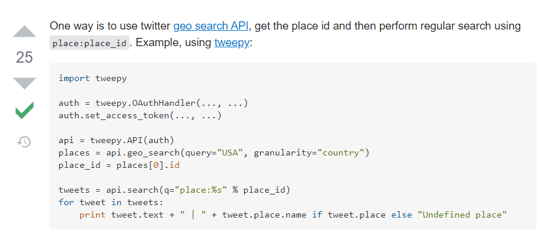

# Links to resources
1. A great blog describing how to scrape with the location using snscrape [https://medium.com/swlh/how-to-scrape-tweets-by-location-in-python-using-snscrape-8c870fa6ec25]
2. To find out the place id of India refer this thread[https://stackoverflow.com/questions/17633378/how-can-we-get-tweets-from-specific-country]

